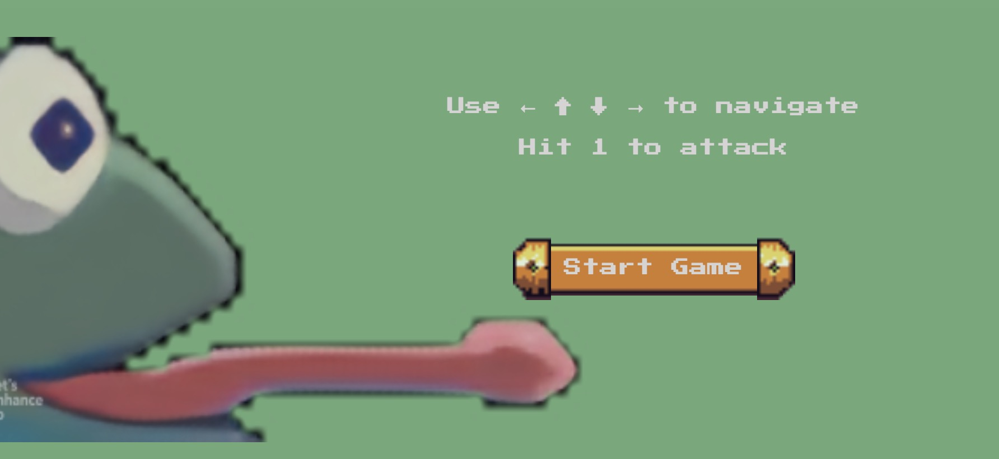
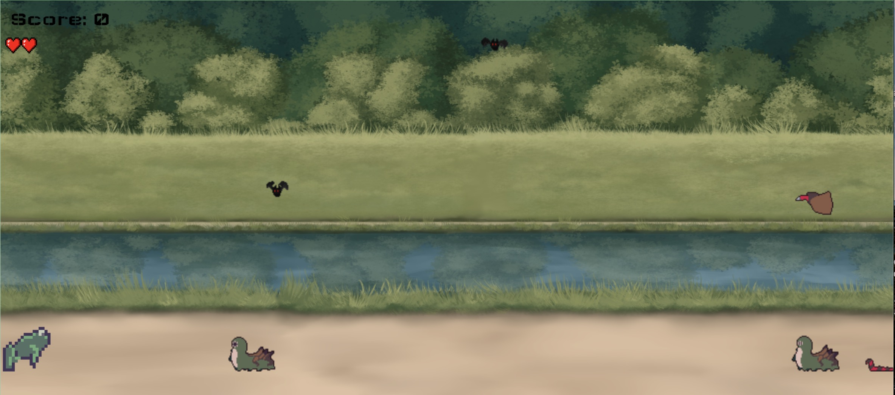

# THE FROG

### Pure Vanilla Javascript Game

#### This game is made by me in one week

##### Enjoy Playing It! 
##### Thank you!

I had to use these resources to find out how to build this game:

- https://www.youtube.com/watch?v=GFO_txvwK_c&t=882s

- https://www.youtube.com/watch?v=47eXVRJKdkU&t=675s

#####Big thank you for providing assets and library to:

- frog(main character)
https://elihaun.itch.io/frog-platformer-tileset

- Parallax background
https://styloo.itch.io/river-parallax-background

- library(used for button in main menu)
https://ronenness.github.io/RPGUI/

